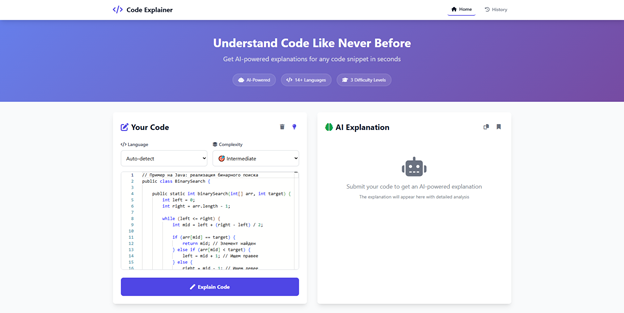
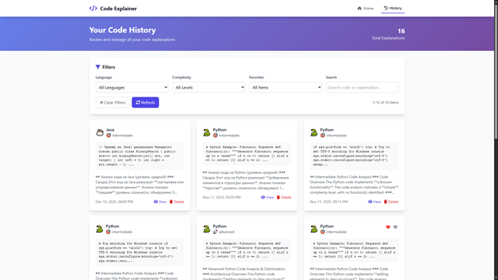

# Code Explainer — AI-инструмент для анализа кода

Современное веб-приложение, которое использует ИИ для пояснения фрагментов кода на естественном языке, помогая разработчикам быстрее понимать сложные участки.



## 🌟 Возможности

### Основной функционал
- **ИИ-объяснения**: анализ на базе CodeLlama 70B.
- **Поддержка нескольких языков**: более 14 языков программирования.
- **Три уровня сложности**: пояснения для новичков, среднего уровня и продвинутых.
- **Умное определение языка**: автоматическое распознавание языка по коду.
- **Валидация кода**: проверка синтаксиса и структуры.

### Пользовательский интерфейс
- **Современный веб-интерфейс**: адаптивный дизайн и плавные анимации.
- **Редактор в стиле VS Code**: подсветка синтаксиса и удобное редактирование.
- **Обработка в реальном времени**: обратная связь во время анализа.
- **Насыщенные объяснения**: форматированный Markdown с примерами.

### Управление историей
- **История объяснений**: сохранение и просмотр прошлых ответов.
- **Расширенная фильтрация**: фильтры по языку, сложности, избранному и поиску.
- **Система избранного**: быстрый доступ к важным объяснениям.
- **Экспорт**: копирование пояснений в буфер обмена.
- **Пагинация**: удобная навигация по большой истории.

### Возможности API
- **RESTful API**: аккуратные и понятные эндпойнты.
- **Swagger-документация**: интерактивный интерфейс для работы с API.
- **Мониторинг состояния**: эндпойнты для проверки здоровья сервиса.
- **Обработка ошибок**: единый формат ошибок и понятные сообщения.

## 🛠 Технологический стек

### Бэкенд
- **FastAPI**: современный и быстрый Python-фреймворк.
- **SQLAlchemy**: ORM и инструменты для работы с SQL.
- **SQLite**: лёгкая база данных для хранения объяснений.
- **CodeLlama 70B**: продвинутая LLM для анализа кода.
- **Pydantic**: валидация данных через аннотации типов Python.

### Фронтенд
- **Vanilla JavaScript**: современный ES6+ без тяжёлых фреймворков.
- **Tailwind CSS**: utility-first CSS-подход.
- **Monaco Editor**: редактор от VS Code для ввода кода.
- **Font Awesome**: профессиональный набор иконок.
- **Адаптивный дизайн**: удобство на любых устройствах.

## 🚀 Быстрый старт

### Предварительные требования
- Python 3.8 или выше
- pip (менеджер пакетов Python)

### Установка

1. **Клонируйте репозиторий:**
   ```bash
   git clone <repository-url>
   cd code-explainer
   ```

2. **Установите зависимости:**
   ```bash
   cd backend
   pip install -r requirements.txt
   ```

3. **Запустите приложение:**
   ```bash
   python run.py
   ```

   Или вручную:
   ```bash
   cd backend
   uvicorn app:app --reload --host 0.0.0.0 --port 8000
   ```

4. **Откройте приложение:**
   - **Основной интерфейс**: http://localhost:8000/static/index.html
   - **Страница истории**: http://localhost:8000/static/history.html
   - **Документация API**: http://localhost:8000/docs

## 📖 Подробное руководство по использованию интерфейса

### Главная страница: получение объяснения кода


*Главный интерфейс Code Explainer с редактором кода слева и панелью объяснений справа*

#### Шаг 1: Ввод кода

**Редактор Monaco Editor** предоставляет среду редактирования со слудующими функциями:

- **Подсветка синтаксиса**: автоматическая подсветка для выбранного языка
- **Нумерация строк**: для удобной навигации
- **Автоматическое форматирование**: базовое форматирование кода
- **Поддержка горячих клавиш**: стандартные сочетания клавиш (Ctrl+C, Ctrl+V и т.д.)
- **Автоматическое изменение размера**: редактор адаптируется под размер окна

**Способы добавления кода:**
1. **Ввод вручную**: просто начните печатать в редакторе
2. **Вставка из буфера обмена**: Ctrl+V (или Cmd+V на Mac)
3. **Загрузка примера**: нажмите кнопку с иконкой лампочки (💡) для загрузки готового примера кода

**Кнопка очистки**: нажмите кнопку с иконкой корзины (🗑️), чтобы очистить редактор

#### Шаг 2: Выбор языка программирования

Выпадающий список **"Language"** позволяет:

- **Auto-detect** (по умолчанию): автоматическое определение языка по синтаксису кода
- **Ручной выбор**: выберите конкретный язык из списка:
  - 🐍 Python
  - 🟨 JavaScript
  - ☕ Java
  - ⚡ C++
  - 🔷 C#
  - 🐘 PHP
  - 💎 Ruby
  - 🐹 Go
  - 🦀 Rust
  - 🔷 TypeScript
  - 🌐 HTML
  - 🎨 CSS
  - 🗄️ SQL
  - 🐚 Bash

**Когда использовать Auto-detect:**
- Когда вы не уверены в языке кода
- Для смешанного кода (например, HTML с встроенным JavaScript)
- Для быстрого анализа без дополнительных настроек

**Когда выбрать язык вручную:**
- Когда автоопределение даёт неверный результат
- Для повышения точности анализа
- Когда код неполный и паттерны языка неочевидны

#### Шаг 3: Выбор уровня сложности объяснения

Выпадающий список **"Complexity"** определяет глубину и стиль объяснения:

**🌱 Beginner (Новичок)**
- Идеально для: начинающих программистов, студентов
- Характеристики:
  - Простые объяснения без технического жаргона
  - Пошаговый разбор каждого элемента
  - Примеры аналогий для понимания концепций
  - Объяснение базовых терминов

**🎯 Intermediate (Средний)**
- Идеально для: опытных разработчиков, изучающих новый язык
- Характеристики:
  - Подробные технические объяснения
  - Лучшие практики и паттерны
  - Анализ структуры кода
  - Рекомендации по улучшению

**🚀 Advanced (Продвинутый)**
- Идеально для: экспертов, работающих с производительностью
- Характеристики:
  - Глубокий анализ архитектуры
  - Оптимизация производительности
  - Альтернативные подходы
  - Анализ сложности алгоритмов
  - Обсуждение компромиссов

#### Шаг 4: Генерация объяснения

После настройки параметров:

1. **Нажмите кнопку "Explain Code"**
2. **Индикатор загрузки**: появится анимация загрузки с сообщением "Analyzing your code with AI..."
3. **Ожидание**: обработка занимает несколько секунд (в мок-режиме мгновенно)
4. **Результат**: объяснение появится в правой панели

#### Шаг 5: Работа с результатом

**Панель объяснения** содержит:

1. **Основной текст объяснения**:
   - Форматированный Markdown текст
   - Подсвеченные блоки кода
   - Заголовки и списки
   - Выделение важных моментов

2. **Статистика обработки** (внизу панели с объяснением):
   - **Processing Time**: время генерации объяснения в секундах
   - **Language**: определённый язык программирования
   - **Complexity**: выбранный уровень сложности

3. **Действия с объяснением**:
   - **Копирование**: кнопка в правом верхнем углу — копирует объяснение в буфер обмена
   - **Сохранение**: кнопка закладки — сохраняет объяснение в избранное

### Страница истории: управление объяснениями

Доступ: кликните на кнопку **"History"** в навигационном меню



*Страница истории со всеми сохранёнными объяснениями, фильтрами и поиском*

#### Обзор страницы

Верхняя панель показывает:
- **Общее количество объяснений**: отображается в правом верхнем углу

#### Фильтрация и поиск

**Панель фильтров** находится вверху страницы:

1. **Фильтр по языку**:
   - Выпадающий список со всеми поддерживаемыми языками
   - Выбор "All Languages" отключает фильтр
   - Показывает только объяснения выбранного языка

2. **Фильтр по сложности**:
   - Beginner, Intermediate, Advanced
   - Выбор "All Levels" отключает фильтр

3. **Фильтр избранного**:
   - "All" — показывает все объяснения
   - "Favorites Only" — показывает только избранные записи
   - "Non-Favorites" — показывает только не избранные

4. **Поиск**:
   - Текстовое поле для поиска
   - Ищет по коду и объяснениям одновременно
   - Работает в реальном времени (debounce 300ms)
   - Не чувствителен к регистру

**Очистка фильтров**: кнопка "Clear Filters" сбрасывает все фильтры и поиск

**Обновление**: кнопка "Refresh" (🔄) обновляет список объяснений

#### Карточки объяснений

Каждая карточка показывает:

1. **Заголовок**:
   - Иконка языка программирования
   - Название языка
   - Иконка уровня сложности и его название

2. **Превью кода**:
   - Первые 200 символов кода
   - Синтаксическая подсветка
   - Многоточие (...) если код длиннее

3. **Превью объяснения**:
   - Первые 300 символов объяснения
   - Обрезано с многоточием если длиннее
   - Без HTML разметки

4. **Метаданные**:
   - Дата и время создания (форматированная)
   - Кнопка "View" (👁️) — открывает модальное окно
   - Кнопка "Delete" (🗑️) — удаляет запись с подтверждением

#### Модальное окно просмотра

Открывается при клике на карточку или кнопку "View":


*Модальное окно с полным кодом, объяснением и действиями*

**Содержимое модального окна:**

1. **Заголовок с метаданными**:
   - Полный код с синтаксической подсветкой
   - Язык программирования
   - Уровень сложности
   - Дата и время создания

2. **Полное объяснение**:
   - Полный текст с Markdown форматированием
   - Все блоки кода, списки, заголовки
   - Scrollable область

3. **Панель действий** (внизу модального окна):
   - **Add to Favorites / Remove from Favorites** (❤️): переключение избранного
   - **Copy Explanation** (📋): копирование объяснения в буфер обмена
   - **Delete Explanation** (🗑️): удаление с подтверждением
   - **Close** (✕): закрытие модального окна

**Закрытие модального окна**:
- Кнопка "Close"
- Клик вне окна (на затемнённую область)
- Клавиша Esc (будущая функция)

#### Пагинация

Если объяснений больше, чем помещается на одной странице:

- **Информация о странице**: "Page X of Y"
- **Кнопка "Previous"** (◀️): переход на предыдущую страницу (неактивна на первой)
- **Кнопка "Next"** (▶️): переход на следующую страницу (неактивна на последней)
- **Размер страницы**: 12 записей по умолчанию

**Статистика страницы**:
- Показывает диапазон записей: "1-12 of 50"
- Обновляется при фильтрации

### Горячие клавиши и советы

#### Советы по эффективному использованию

1. **Для быстрого анализа**:
   - Используйте Auto-detect для языка
   - Выберите Intermediate уровень сложности
   - Загрузите пример кода для ознакомления

2. **Для обучения**:
   - Начните с Beginner уровня
   - Постепенно переходите к Intermediate и Advanced
   - Используйте избранное для сохранения важных объяснений

3. **Для работы в команде**:
   - Копируйте объяснения для документации
   - Сохраняйте сложные части кода в избранном
   - Используйте поиск для быстрого нахождения прошлых объяснений

4. **Для анализа большого кода**:
   - Разбивайте большие файлы на логические части
   - Анализируйте функции отдельно
   - Используйте фильтры для организации по языкам

### Обратная связь и уведомления

Система показывает уведомления для:
- ✅ **Успешные операции**: "Explanation generated successfully!", "Explanation copied to clipboard!"
- ⚠️ **Предупреждения**: "Please enter some code to explain"
- ❌ **Ошибки**: "Failed to generate explanation. Please try again."
- ℹ️ **Информация**: "Loaded python example code"

Уведомления появляются в правом верхнем углу и автоматически исчезают через 3 секунды.

## 🔧 Использование API

### Объяснение кода

```python
import requests

response = requests.post('http://localhost:8000/code/explain', json={
    'code_snippet': 'def fibonacci(n): return n if n <= 1 else fibonacci(n-1) + fibonacci(n-2)',
    'language': 'python',
    'complexity_level': 'intermediate'
})

explanation = response.json()
print(explanation['explanation'])
```

### История объяснений

```python
response = requests.get('http://localhost:8000/history/explanations')
history = response.json()

for item in history['explanations']:
    print(f"ID: {item['id']}, Language: {item['language']}")
```

## 🎯 Поддерживаемые языки

- **Python** 🐍
- **JavaScript** 🟨
- **Java** ☕
- **C++** ⚡
- **C#** 🔷
- **PHP** 🐘
- **Ruby** 💎
- **Go** 🐹
- **Rust** 🦀
- **TypeScript** 🔷
- **HTML** 🌐
- **CSS** 🎨
- **SQL** 🗄️
- **Bash** 🐚

## 🏗 Архитектура

### Архитектура бэкенда

```
backend/
├── app.py              # Инициализация FastAPI-приложения
├── models.py           # Модели Pydantic для валидации
├── database.py         # Подключение к БД и модели ORM
├── api/
│   ├── code.py         # Эндпойнты объяснения кода
│   └── history.py      # Эндпойнты работы с историей
└── services/
    ├── llm_service.py  # Слой интеграции с LLM
    └── code_analyzer.py # Утилиты анализа кода
```

### Архитектура фронтенда

```
frontend/
├── index.html          # Основной интерфейс приложения
├── history.html        # Страница управления историей
├── main.js             # Основная логика JavaScript
└── resources/          # Статические ресурсы
```

## 🔍 Как это работает

### Процесс объяснения кода

1. **Отправка кода**: пользователь отправляет код через веб-интерфейс.
2. **Валидация**: проверка синтаксиса и структуры.
3. **Определение языка**: автоматическое распознавание языка.
4. **Анализ кода**: предварительный анализ структуры кода (функции, переменные, конструкции).
5. **Обработка LLM**: код отправляется в CodeLlama 70B для анализа.
6. **Генерация объяснения**: ИИ формирует обучающий ответ.
7. **Форматирование ответа**: результат приводится в удобный вид.
8. **Сохранение истории**: объяснение сохраняется в базе для дальнейшего доступа.

## 🤖 Взаимодействие с CodeLlama

### Обзор интеграции

Code Explainer использует **CodeLlama 70B-Instruct** — специализированную языковую модель от Meta, обученную на коде. Интеграция реализована через **Hugging Face Inference API**.

### Архитектура взаимодействия

```
Пользователь → FastAPI → CodeAnalyzer → LLMService → Hugging Face API → CodeLlama 70B
                                                    ↓
                                              (при ошибке)
                                                    ↓
                                              Mock Service
```

### Два режима работы

#### 1. Реальный режим (CodeLlama API)

При использовании реального API Hugging Face:

- **API Endpoint**: `https://api-inference.huggingface.co/models/codellama/CodeLlama-70b-Instruct-hf`
- **Метод запроса**: POST
- **Формат данных**: JSON с промптом и параметрами генерации
- **Timeout**: 60 секунд
- **Параметры генерации**:
  - `max_new_tokens`: 1000 (максимальная длина ответа)
  - `temperature`: 0.1 (низкая температура для детерминированных объяснений)
  - `return_full_text`: False (возвращать только сгенерированный текст)

#### 2. Мок-режим

Для разработки и тестирования используется мок-сервис, который:
- Не требует API ключа Hugging Face
- Работает мгновенно без задержек
- Использует результаты предварительного анализа кода для генерации объяснений
- Создаёт детальные объяснения на основе структуры кода

**Включение реального режима:**
```bash
export USE_MOCK_LLM=false
# Или в docker-compose.yml:
environment:
  - USE_MOCK_LLM=false
```

### Процесс генерации промпта

Перед отправкой кода в CodeLlama система создаёт структурированный промпт:

```python
<s>[INST] <<SYS>>
Ты опытный преподаватель программирования. Объясни следующий {language} код понятным и обучающим языком.

Рекомендации:
- Целевая аудитория: уровень {complexity_level}
- {guidelines для уровня сложности}
- При необходимости давай построчные комментарии
- Отмечай лучшие практики и возможные улучшения
- Раскрывай логику и обоснование выбранных решений
- Используй корректное форматирование в markdown

Код для объяснения:
```{language}
{code_snippet}
```

Дай развёрнутое объяснение.[/INST]
```

### Уровни сложности и их влияние на промпт

#### Beginner (🌱 Новичок)
- Простые объяснения базовыми словами
- Пошаговый разбор сложных понятий
- Фокус на понимании концепций, а не технических деталях
- Минимум жаргона

#### Intermediate (🎯 Средний)
- Подробные объяснения с лучшими практиками
- Техническое обоснование решений
- Баланс между простотой и глубиной
- Рекомендации по улучшению кода

#### Advanced (🚀 Продвинутый)
- Глубокий технический анализ
- Советы по оптимизации
- Альтернативные подходы
- Обсуждение архитектурных решений
- Анализ производительности и памяти

### Предварительный анализ кода

Перед отправкой в LLM код проходит анализ через `CodeAnalyzer`:

1. **Определение языка** — распознавание по паттернам и синтаксису
2. **Извлечение функций** — список функций, классов, методов
3. **Анализ структур** — управляющие конструкции (if, for, while и т.д.)
4. **Определение переменных** — ключевые переменные в коде
5. **Выявление операций** — арифметические операции, работа с памятью, структурами данных
6. **Оценка сложности** — простая, средняя или сложная
7. **Определение назначения** — что делает код (сортировка, поиск, вычисления и т.д.)

Эта информация передаётся в LLM для более точных и релевантных объяснений.

### Обработка ответа

После получения ответа от CodeLlama:

1. **Очистка текста** — удаление лишних символов
2. **Проверка форматирования** — гарантия корректных markdown блоков кода
3. **Экранирование** — обработка специальных символов для безопасного отображения

### Обработка ошибок

Система автоматически переключается на мок-режим при:
- Отсутствии ответа от API (timeout)
- Ошибках HTTP (4xx, 5xx)
- Сетевых проблемах
- Отсутствии API ключа

Это гарантирует работу приложения даже при недоступности внешнего API.

### Настройка для продакшена

Для использования реального CodeLlama в продакшене:

1. Получите API ключ на [Hugging Face](https://huggingface.co/settings/tokens)
2. Настройте переменные окружения:
   ```bash
   export USE_MOCK_LLM=false
   export HUGGINGFACE_API_KEY=your_api_key_here
   ```
3. Добавьте заголовок авторизации в запросы (требуется модификация кода)
4. Учтите ограничения API:
   - Rate limits
   - Задержки ответа (может быть до 30-60 секунд)
   - Стоимость использования

## 🧪 Тестирование

Запуск тестового набора:

```bash
cd backend
pytest ../tests/
```

### Ручное тестирование

1. **Проверка объяснения:**
   - Отправьте код на разных языках.
   - Протестируйте все уровни сложности.
   - Оцените качество объяснений.

2. **Проверка истории:**
   - Сохраните несколько объяснений.
   - Протестируйте фильтры и поиск.
   - Убедитесь, что пагинация работает корректно.

3. **Проверка API:**
   - Используйте Swagger UI по адресу `/docs`.
   - Протестируйте сценарии с ошибками.
   - Убедитесь в корректности формата ответов.

## 🚀 Деплой

### Через Docker (рекомендуется)

Для Windows Desktop с Docker Desktop:

```bash
# Быстрый запуск
docker-compose up --build

# Или в фоновом режиме
docker-compose up -d --build
```

📖 **Подробная документация**: см. [docs/DOCKER.md](docs/DOCKER.md) для полного руководства по использованию Docker, включая настройку переменных окружения, устранение неполадок и рекомендации по продакшену.

**Краткая инструкция**: см. [DOCKER_QUICKSTART.md](DOCKER_QUICKSTART.md)

### Через Gunicorn

Для продакшен-деплоя на сервере:

```bash
pip install gunicorn
gunicorn app:app -w 4 -k uvicorn.workers.UvicornWorker --bind 0.0.0.0:8000
```

## 🔒 Безопасность

- **Валидация входных данных**: все запросы проходят проверку через Pydantic.
- **Защита от SQL-инъекций**: используется ORM SQLAlchemy.
- **Настройка CORS**: готовность к продакшен-конфигурации.
- **Обработка ошибок**: без вывода чувствительной информации.
- **Ограничение частоты**: рекомендуется включить в боевой среде.

## 📝 Конфигурация

### Переменные окружения

```bash
# Использование мок-сервиса LLM (по умолчанию: true)
export USE_MOCK_LLM=true

# Путь к базе данных
export DATABASE_PATH=/path/to/database.db

# Параметры API
export API_HOST=0.0.0.0
export API_PORT=8000
```

### База данных

- **Тип**: SQLite (файловая база).
- **Расположение**: `backend/code_explainer.db`.
- **Миграции**: создаётся автоматически при первом запуске.
- **Резервное копирование**: достаточно скопировать файл базы.

## 🤝 Участие в разработке

1. Форкните репозиторий.
2. Создайте ветку для новой функции.
3. Внесите изменения.
4. Добавьте тесты при необходимости.
5. Откройте pull request.

## 📞 Поддержка

При возникновении вопросов:

1. Загляните в раздел устранения неполадок в документации.
2. Ознакомьтесь с документацией API по адресу `/docs`.
3. Проверьте логи приложения.
4. Создайте issue в репозитории.

---

**Удачного кодинга!** 🎉

Команда Code Explainer стремится помочь разработчикам лучше понимать код с помощью ИИ.

